# Procesverslag
Markdown is een simpele manier om HTML te schrijven.  
Markdown cheat cheet: [Hulp bij het schrijven van Markdown](https://github.com/adam-p/markdown-here/wiki/Markdown-Cheatsheet).

Nb. De standaardstructuur en de spartaanse opmaak van de README.md zijn helemaal prima. Het gaat om de inhoud van je procesverslag. Besteedt de tijd voor pracht en praal aan je website.

Nb. Door *open* toe te voegen aan een *details* element kun je deze standaard open zetten. Fijn om dat steeds voor de relevante stuk(ken) te doen.

## Jij

  
Uitwerken voor kick-off werkgroep

  ### Auteur:
  Sena Nur Korkutan

  #### Je startniveau:
  Rood niveau

  #### Je focus:
  Responsive design
 

## Je website

  
Uitwerken voor kick-off werkgroep

  ### Je opdracht:
  https://www.benjerry.nl/ 

  #### Screenshot(s) van de eerste pagina (small screen): 
  Ben&Jerry's 
   
  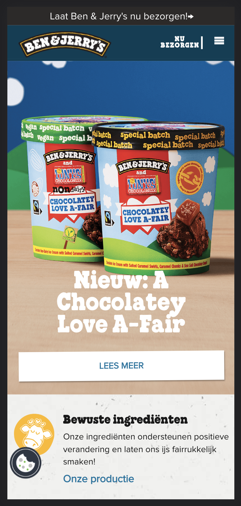

  #### Screenshot(s) van de tweede pagina (small screen):
  Ben&Jerry's 
   
  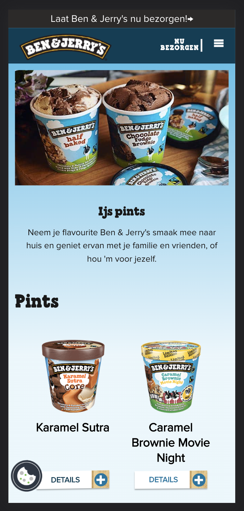
 

## Toegankelijkheidstest 1/2 (week 1)

  
Uitwerken na test in 1e werkgroep

  ### Bevindingen

  Lijst met je bevindingen die in de test naar voren kwamen:

  
  + Bewegen van knoppen is goed. Omdat je kan begrijpen dat het een knop is.

  + Als je hovert, opent het menu elementen. Het is echt handig.

  - Responsive design is soms traag.

  - Als er zwakke internet connection is, kan foto's niet lekker werken.

  Hier een omschrijving van hoe het opgelost kan worden (met indien nodig afbeeldingen)
  - Ik kan de website responsive maken.

  - Ik kan een uitleg over het product schrijven zodat gebruiker de product zou weten als het internet niet lekker is.

  #### Screenreader
  Hier korte omschrijving (met indien nodig afbeeldingen)

  + De lopende volgerde van elementen zijn goed.
  + Elke section heeft een kopje het ziet goed eruit.

  - Sommige elementen (bijv. mail input plek) staan niet in de juiste kategorie.  
  - Bij sommige kategorieen (words, letters, form controls en window spots) werken niet lekker. Mischien komt het door dat wij de VoiceOver functie niet goed kan gebruiken.

  Hier een omschrijving van hoe het opgelost kan worden (met indien nodig afbeeldingen)
  

  - Het zou handig zijn als ik de semantiek van het html bestand goed maak.

  #### Muis en Toetsenbord 

  Hier korte omschrijving (met indien nodig afbeeldingen)

  
  - Site is duidelijk en beeindigd snel omdat er veel foto's staan.
  - Het is echt makkelijk te volgen en werkt lekker met toetsenbord.

  - Soms linkjes van menubalk is irritant.
  
  

  Hier een omschrijving van hoe het opgelost kan worden (met indien nodig afbeeldingen)
  -Bij menubalk kan gebruiker altijd skippen met klikken in een andere plek. Wij kunnen de site niet helemaal veranderen.

  #### Motoriek (shocks, elastiekjes)
  Hier korte omschrijving (met indien nodig afbeeldingen)

  
  + Knoppen zijn groot. Dus er was niet een probleem met klikken van knoppen.
  + Bij scrollen was het ook niet een probleem.

  - Er was een linkje een beetje moeilijk te kunnen klikken.
  - Het doet pijn.

  Hier een omschrijving van hoe het opgelost kan worden (met indien nodig afbeeldingen)
  - Ik kan die linkje misschien in een knop zetten of de klikbare plek (padding of margin) vergroten zonder borders.
  

  #### Visueel (brillen, contrast, kleurenblind, dark/light). 
  Hier korte omschrijving (met indien nodig afbeeldingen)

  
  + De website ziet brillen met klueren (gele bril, bril met zwarte puntje etc.) goed eruit en werkt probleemloos.
  + De website ziet met andere brillen beetje moeilijk maar wel nog steeds leesbaar.
  + Er is geen probleem met zien van belangrijke elementen bij kleurblind.

  - Met de sterke blur bril kan de gebruiker bijna niks te zien. Ook is het heel moeilijk het muis te vinden.
  - Met blur bril en bril met puntje is alles moeilijk te zien. Kopjes en subkopjes kun je wel lezen maar teksten niet.
  - Het is niet mogelik de taal knop te zien in paar van de kleurbliinden modus. 
  - In de laatste kleurblind modus kan de gebruiker niet makkelijk weten dat een link een link is. Omdat er geen kleur. (In de site word gebruik maken van de kleuren om gebruiker laten te zien dat het een linkje is. Maar voor kleurblinden werkte het gewoon niet lekker.)
  
  Hier een omschrijving van hoe het opgelost kan worden (met indien nodig afbeeldingen)
  - Ik kan misschien koppen nog groter of dikker doen.
  - Ik kan de linkjes een klein animatie toevoegen zodat kleurblinden mogen ook weten dat het een linkje is.
  - Ik kan de taal knop veranderen met wereld icoontje of  met een tekstje dat laten zien welke taal het is.

## Breakdownschets (week 1)

  
Uitwerken na afloop 2e werkgroep

  ### de hele pagina: 
  

  ### dynamisch deel (bijv menu): 
  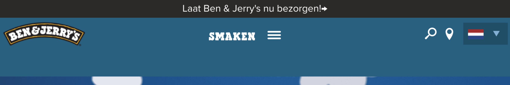

  ### wellicht nog een dynamisch deel (bijv filter): 
  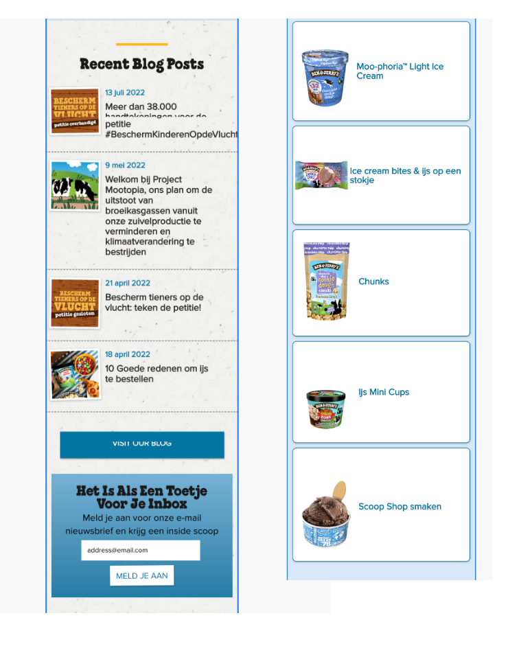

## Voortgang 1 (week 2)

  
Uitwerken voor 1e voortgang

  ### Stand van zaken
  Hier dit ging goed & dit was lastig (neem ook screenshots op van delen van je website en code)

  - Sticky header
  - Ik had geen html-document met een semantische correcte html-layout. Tijdens het gesprek hebben we het samen geanalyseerd en geleerd hoe het moet. (Ik heb helaas geen screenshots omdat ik alles in de gesprek verander.)
  - Ik had geen css dus wij praten niet erover.

  ### Agenda voor meeting
  -- Eerste week hebben we de meeting met onze groepjes niet gedaan. Wij hebben alleen voortgang gesprek met Sanne gedaan.

  | student 1      | student 2          | student 3    | student 4        |
  | ---            | ---                | ---          | ---              |
  | dit bespreken  | en dit             | en ik dit    | en dan ik dat    |
  | en dat ook nog | dit als er tijd is | nog een punt | dit wil ik zeker |
  | ...            | ...                | ...          | ...              |

  ### Verslag van meeting
  Hier na afloop snel de uitkomsten van de meeting vastleggen

  - Ik moet dingen verbeteren op <head> (personaal informatie toevoegen)
  - Section begint altijd met een titel. Als het niet zo is, voeg een aria-label toe.
  - Article is ook een speciale section.
  - Maak een goede html. Dan kan je met css dingen verbeteren. (bijv. uppercase maken en semantische goed html elementen omdraaien)
  - Als main heeft geen titel, maak een titel. Daarna kan je hem in css wegsturen.
  - Soms ul li werkt beter dan paar sections. Kijk goed naar de situatie.
  - Article moet betekenisvol zijn.
  - Ik heb handige shortcuts geleerd.

## Voortgang 2 (week 3)

  
Uitwerken voor 2e voortgang

  ### Stand van zaken
  hier dit ging goed & dit was lastig (neem ook screenshots op van delen van je website en code)

  Wat ik wil vragen?
  - In inspector kan ik alleen “main” zien. Het is niet mogelijk om andere elementen te zien. Ik wil ook de elementen binnen main kijken doordat ik weet wat ik niet goed deed. Maar het is nu niet moeglijk.
  - Wat is de handigste manier om h2 en leer meer knop onder elkaar te zetten op img.
  - Hamburger menu kruisje werkt niet.
  - Img tussen twee sections werkt niet lekker. (Bijna 3 uur bezig maar het lukte bij mij niet)
  - Derde section grid h3 center maken 
  - Wat is de minimale en maximale scherm size tijdens gesprek testen?
  - Lees meer knop responsive maken (ik heb nowrap probeert maar het lukte niet.)

  ### Agenda voor meeting
  Vrijdag om 10 uur
  
  | Laura      | Idelene         | Mohini  | Shanine     | Shani |
  | ---            | ---                | ---          | ---              | --- |
  | Animatie | Positionering    | Responsiveness en de @media tag            | Wanneer wel classes    |  pseudo elementen  |
  | En hoe het zit met de 2e pagina.  | Alt labels  | Stijlen van forms | Element dat vershuift als je scrolt |
  | ...            | ...                | En het hamburgermenu      | ...              | ...            |

  ### Verslag van meeting
  Hier na afloop snel de uitkomsten van de meeting vastleggen

  - Ik krijg geen hulp omdat er geen tijd blijft voor mij.
  - Ik studeerde mezelf tijdens gesprek, omdat de problemen van anderen niet relevant van mijn problemen.

## Toegankelijkheidstest 2/2 (week 4)

  
Uitwerken na test in 8e werkgroep

  ### Bevindingen

  Lijst met je bevindingen die in de test naar voren kwamen (geef ook aan wat er verbeterd is): 

  + Knoppen en linken zijn wel klikbaar. Verander ze niet. (vanuit parkinson test)

  + Titels zijn goed bij screen reader

  + Het lukt bij meeste brillen

  + Elastiek is wel makkelijk te gebruiken

  + Accesbilty kleuren lukt en eigenlijk zien ze mooi eruit sommige van ze. (kleur test van chrome)

  
  - Hamburger menu is items niet leesbaar (gemaakt)
    - Nu is het mogelijk te lezen. Het kwam door kleuren. 

  - Paar woord fouten (gemaakt)
  
  - Elementen binnen hamburger menu is leesbaar/mogelijk te tabben.
    - Ik probeer het probleem heel lang te oplossen maar ik kon het niet oplossen. Daarom ga ik door met andere stylingen.

  - Bij blur mode is het niet makkelijk te lezen. Misschien nog grote letters? (gemaakt)
    - Vierde section 
 mag nog groeter worden 
      - Het lijkt me handig consistent te blijven binnen website. Daarom heb ik het niet verandert.
  
  - Tab leest niet <a> van vierde section. (gemaakt)

  #### Screenreader
  Hier korte omschrijving (met indien nodig afbeeldingen)
  + Titels werken goed

  - Het leest binnen hamburger menu !
  - 4de section linken werken niet goed

  Hier een omschrijving van hoe het opgelost kan worden (met indien nodig afbeeldingen)
  - Momenteel heb ik geen idee over binnen hamburger menu (vragen)
    - Ik heb het gevraagd en Sanne zegt dat het nu niet nodig is. (na het vragen)

  - Ik kan de <a> element binnen de <h3> element halen. (gemaakt)

  #### Muis en Toetsenbord 
  Hier korte omschrijving (met indien nodig afbeeldingen)
  + Volgerde van HTML elementen goed te volgen
  + Elementen zijn makkelijk klikbaar, alle linken werken goed

  - Geen hover, active effect
  - Paar woord fouten
  - Tab (focus state) gaat door binnen hamburger menu
  

  Hier een omschrijving van hoe het opgelost kan worden (met indien nodig afbeeldingen)
  - Ik moet nog states toevoegen
  - Woord fouten verbeteren
  - Momenteel heb ik geen idee over binnen hamburger menu (vragen)
    - Ik heb het gevraagd en Sanne zegt dat het nu niet nodig is. (na het vragen)

  #### Motoriek (shocks, elastiekjes)
  Hier korte omschrijving (met indien nodig afbeeldingen)
  + Goed beneden kan scrollen (shocks)
  + Makkelijk te toetsenbord te gebruiken (shocks)
  + Button en linken zijn wel goed klikbaar (shocks)

  - Soms wordt het moeilijk naar beneden te gaan. Maar het is niet de probleem van de website. Het is de probleem van computer

  Hier een omschrijving van hoe het opgelost kan worden (met indien nodig afbeeldingen)
  - Er is geen probleem over de website

  #### Visueel (brillen, contrast, kleurenblind, dark/light). 
  Hier korte omschrijving (met indien nodig afbeeldingen)

  + Alleen bij blur is het moeilijk te lezen of de luis te vinden. Andere brillen lukken wel bij website
  + Ik vond de kluerenblind modussen leuk qua kleuren. Tritanopia ziet heel schattig en blij eruit. 
  
  - Hover effect is niet te zien in achromatopsia modus
  - Geen dark modus
  - Blur/glare cataract modus is het moeilijk te lezen. Maar als de website nog groter maakt kun je ze wel lezen.

  Hier een omschrijving van hoe het opgelost kan worden (met indien nodig afbeeldingen)

  - Ik moet de hover effect nog beter laten zien in achromatopsia modus
  - Ik kan een dark modus toevoegen

## Voortgang 3 (week 4)

  
Uitwerken voor 3e voortgang

  ### Stand van zaken
  hier dit ging goed & dit was lastig (neem ook screenshots op van delen van je website en code)

  Deze keer was onze het nuttigste gesprek. Ik had nog een keer geen vragen over mijn website maar ik heb wel van anderen vragen ook geleerd. 

  ### Agenda voor meeting
  samen met je groepje opstellen

  |  Laura      | Idelene          | Shanine    | Mila       | Donna      | Sena Nur (ik) |
  | ---            | ---                | ---          | ---              |
  | 1 animatie in javascript doet het, de rest niet  | Object observer api werkt niet             | Hoe maak ik een tabel?    | Carrousel begint op helft van pagina (gefixed door Sjoerd)    | Mag hier een class?     | Blauw lijntje onder plaatje moest weg! (gefixed door Sanne)   |

  ### Verslag van meeting
  hier na afloop snel de uitkomsten van de meeting vastleggen

  - Ik heb geleerd dat ik de media query niet goed gebruik
  - Website moet goed getest worden voor gesprek
  - Do's en Don'ts nog een keer herhalen
  - Goede weg van div gebruiken (ik heb de eerste div na dit gesprek geplaats en het werkte uiteindelijk lekker :) )
  - Met wat zijn wij trots?

## Eindgesprek (week 5)

  
Uitwerken voor eindgesprek

  ### Je uitkomst - karakteristiek screenshots:
  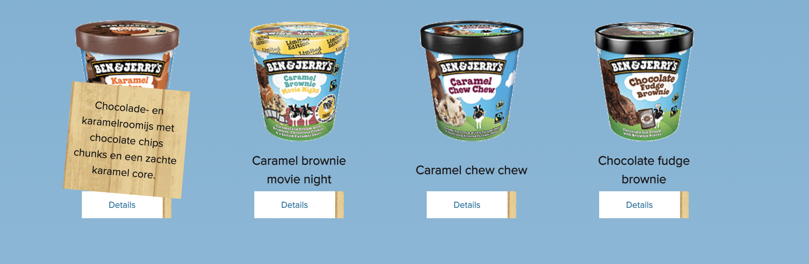
  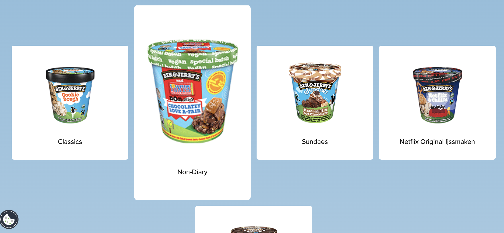
  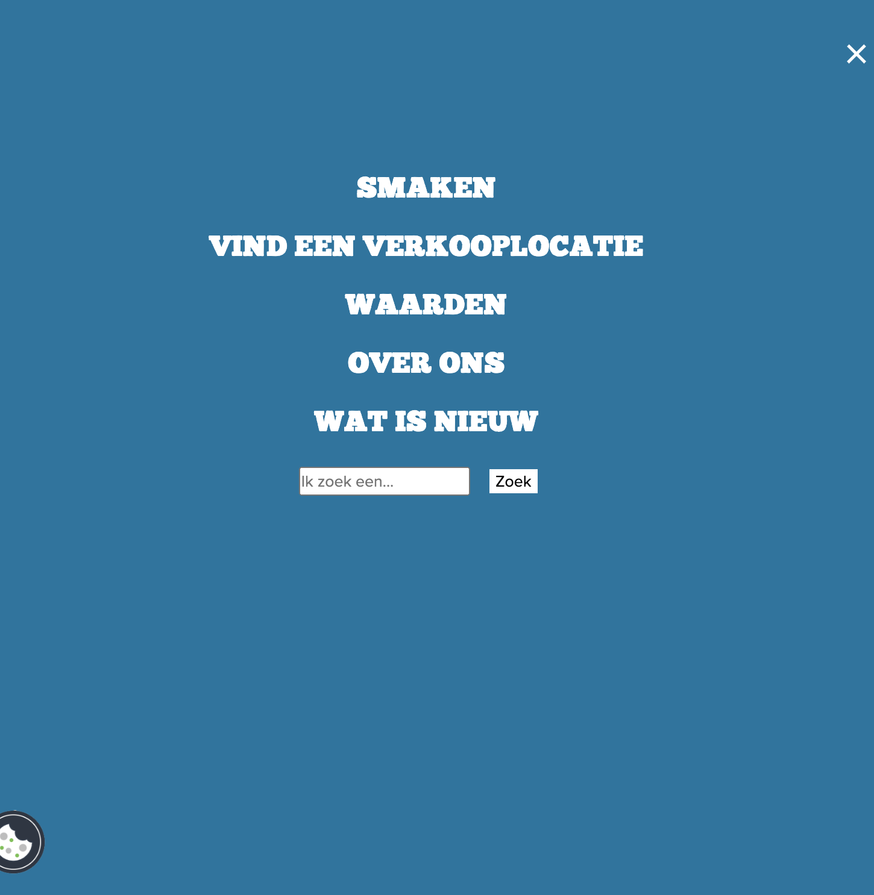

  ### Dit ging goed/Heb ik geleerd: 
  + Ik heb bijna alle code zelf bedacht en geschrijven. Dat ben ik heel trots op. Ik ben bijna pro bij flex en grid
  + Ik begrijp heel duidelijk hoe het structuur van een html document moet zijn. 
  + Ik had moeite mee met sections of li's noemen in css. Maar nu kan ik heel makkelijk elementen uit html noemen.
  + Ik begrijp het logica van javascript. Ik kan nu makkelijk een class toevoegen en in css met het class spelen. 
  + Ik weet nu wat ik niet moet doen als ik een website aan het bouwen.
  + Als je de code vanuit een andere plek gehaald, is bronnen noteren altijd nodig!

  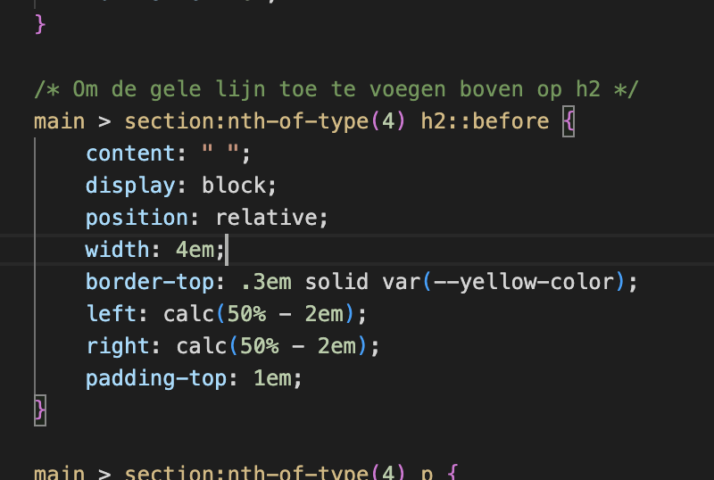
  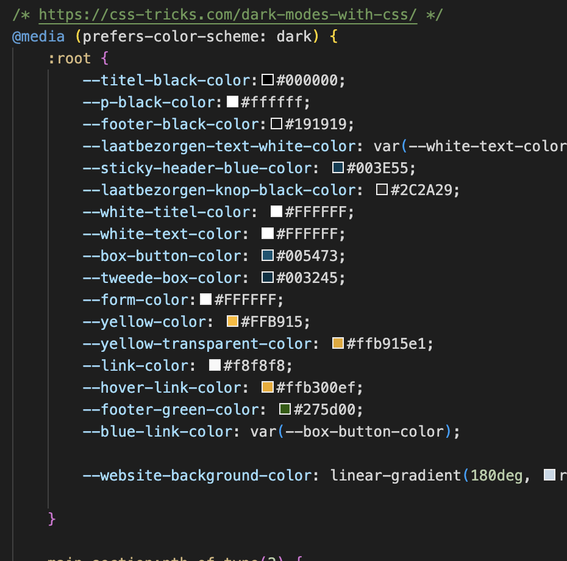
  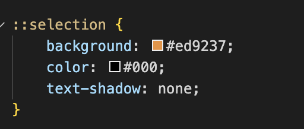

  ### Dit was lastig/Is niet gelukt:
  - Enige ding die ik nog meer wil doen is javascript, helaas bij mij website is er niet zo veel dingen met javascript gemaakt. Dus ik heb minder javascript geschereven. 
  - Hamburger menu bouwen vond ik moeilijk (Hulp gekregen van Sanne)
  - Als ik klikt op hamburger menu, blijft het focus state hangen ?
  - Font downloaden en plakken vond ik heel moeilijk (Hulp gekregen van student assistent)
  - Ik heb de tweede pagina laatste dag begonnen daarom tweede pagina lukte niet zo goed. Maar absoluut ben ik trots wat ik binnen 8 uur heb ik gedaan in tweede pagina.

  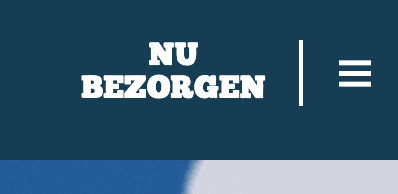
  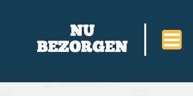

## Bronnenlijst

  
Continu bijhouden terwijl je werkt

  1. https://codepen.io/shooft/pen/vYGZqYV (positioneren)
  2. https://codepen.io/shooft/pen/dymRMBZ?editors=0110 (voor hamburger menu knop)
  3. https://css-tricks.com/snippets/css/a-guide-to-flexbox/ (flexbox)
  4. https://css-tricks.com/snippets/css/complete-guide-grid/ (grid's)
  5. https:css-trickscoma-complete-guide-to-css-media-queries/ (media queries)
  6. https://www.steckinsights.com/shorten-length-border-bottom-pure-css/ (geel lijn bovenop titels)
  7. https://codepen.io/shooft/pen/ZExqBxV (mini beweeg effect)
  8. https://cloudconvert.com/heic-to-png (om foto's converten)
  9. https://css-tricks.com/solved-with-css-dropdown-menus/ (bij tweede pagina maar ik had helaas geen tijd om toe te voegen)
  10. https://www.benjerry.nl/smaken/pints (alle fotos)
  11. https://www.benjerry.nl/ (alle fotos)
  12. https://developer.mozilla.org/en-US/docs/Web/CSS/CSS_Flexible_Box_Layout/Mastering_Wrapping_of_Flex_Items (meer voorbeelden te kijken)
  13. https://codepen.io/shooft/pen/yLKjzWa (geen tijd :\ )

